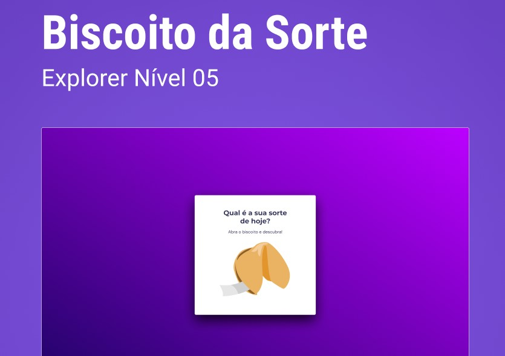

<h1 align="center"> Biscoito da Sorte </h1>

desafio de criar um jogo chamado Biscoito da Sorte, no qual o usuário, a partir de um clique ou enter, abre um biscoito com a sua sorte do dia 

  <a href="#-tecnologias">Tecnologias</a>&nbsp;&nbsp;&nbsp;|&nbsp;&nbsp;&nbsp;
  <a href="#-projeto">Projeto</a>&nbsp;&nbsp;&nbsp;|&nbsp;&nbsp;&nbsp;
  <a href="#-layout">Layout</a>&nbsp;&nbsp;&nbsp;|&nbsp;&nbsp;&nbsp;
  <a href="#memo-licença">Licença</a>

  

 

  

## 🚀 Tecnologias

Esse projeto foi desenvolvido com as seguintes tecnologias:

- Estrutura de dados HTML
- Animações com CSS
- Funções no Javascript
- Manipulação da DOM
- Biblioteca JS Math()
- Funções *callback*
- Arrays

## 💻 Projeto

- [Acesse o projeto finalizado, online](https://marcossantos1990.github.io/biscoito-da-sorte/)

## 🔖 Layout

Você pode visualizar o layout do projeto através [DESSE LINK](https://www.figma.com/file/fiUSLPXzKJCdWRwQumZvH7/Biscoito-da-Sorte-(Community)?node-id=0-1&t=MxLq0NqcmwLrtTM3-0). É necessário ter conta no [Figma](https://figma.com) para acessá-lo.

## :memo: Licença

Esse projeto está sob a licença MIT.